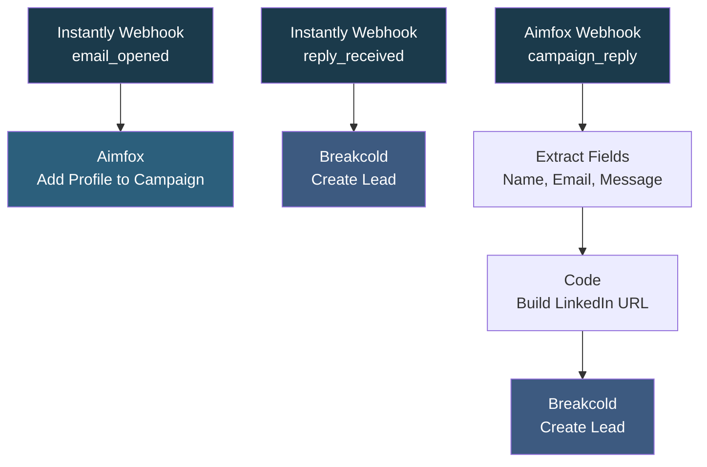

# Instantly to Aimfox Flow

## Overview

This workflow bridges Instantly email campaigns with Aimfox LinkedIn outreach and Breakcold CRM. When a prospect opens an email in Instantly, their LinkedIn profile is automatically added to an Aimfox campaign for multi-channel follow-up. When a prospect replies via email or LinkedIn, they are added to Breakcold as a new lead for relationship tracking. It also handles Aimfox reply webhooks, extracting sender details and creating Breakcold leads from LinkedIn conversations. This creates a seamless multi-channel outreach pipeline where email engagement triggers LinkedIn outreach and all replies flow into your CRM.

## How It Works

**Email open triggers LinkedIn outreach:**
```
Instantly Webhook (email_opened) -> Aimfox: Add profile to LinkedIn campaign
```

**Email reply triggers CRM entry:**
```
Instantly Webhook (reply_received) -> Breakcold: Create lead with LinkedIn + email
```

**Aimfox reply triggers CRM entry:**
```
Aimfox Webhook (campaign_reply) -> Extract fields -> Build LinkedIn URL -> Breakcold: Create lead
```

### Workflow Diagram



## Integrations

- **Instantly** - Email campaign webhooks (opens and replies)
- **Aimfox** - LinkedIn campaign management and reply webhooks
- **Breakcold** - CRM lead creation from both email and LinkedIn replies

## Setup

1. Import `Instantly_to_Aimfox_flow.json` into your n8n instance.
2. Configure Aimfox credentials and update the campaign ID in the "Add profile to campaign" node.
3. Update the Breakcold API key in the HTTP Request headers.
4. Register the webhook URLs in your Instantly and Aimfox campaign settings.
5. Activate the workflow.
